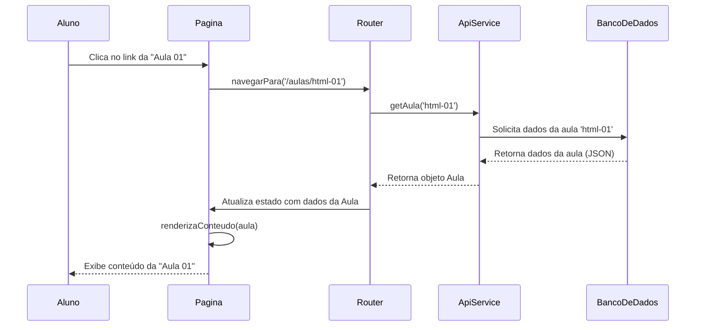
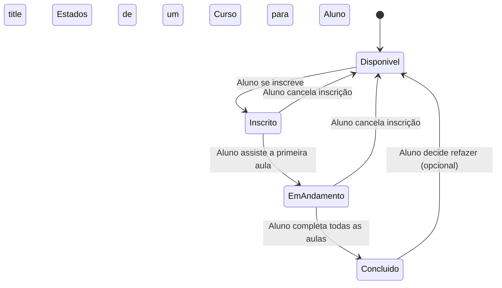
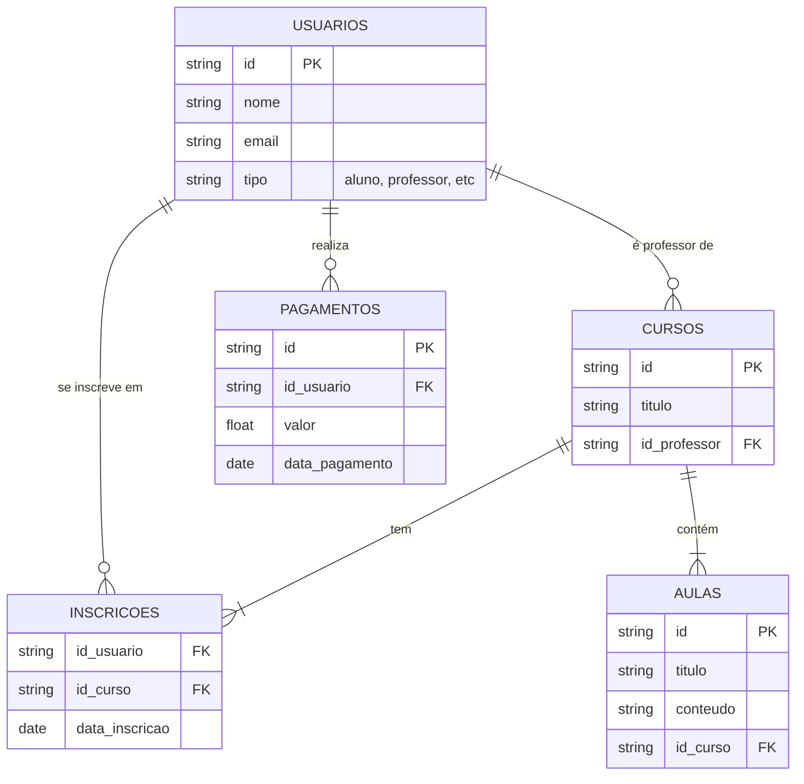
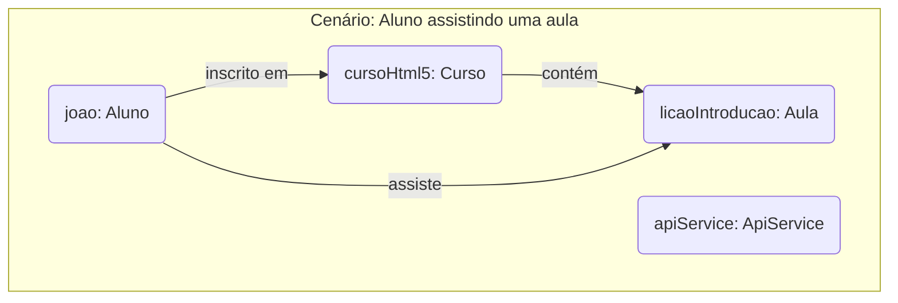

# Diagramas Detalhados do Sistema

Este arquivo contém vários diagramas UML e de entidade-relacionamento para detalhar o design do sistema ML5Lab.

---

## 1. Diagrama de Sequência

Mostra a interação entre os objetos ao longo do tempo. Este exemplo descreve o que acontece quando um aluno tenta assistir a uma aula.



---

## 2. Diagrama de Atividades

Descreve o fluxo de trabalho passo a passo de uma operação. Este exemplo mostra a atividade de um aluno se inscrevendo em um curso pago.

```mermaid
activityDiagram
    title Atividade: Aluno se Inscreve em um Curso
    start
    :Aluno visualiza a lista de cursos;
    :Aluno seleciona um curso;
    if (Curso requer pagamento?) then (sim)
        :Aluno é redirecionado para a página de créditos;
        :Aluno compra créditos;
        if (Pagamento aprovado?) then (sim)
            :Créditos são adicionados à conta;
        else (não)
            :Exibe mensagem de falha no pagamento;
            stop
        endif
        :Sistema debita créditos e inscreve o aluno;
    else (não)
        :Sistema inscreve o aluno diretamente;
    endif
    :Exibe página do curso com aulas disponíveis;
    stop
```

---

## 3. Diagrama de Estados

Modela os diferentes estados em que um objeto pode se encontrar durante seu ciclo de vida. Este exemplo mostra os estados de um `Curso` na perspectiva de um `Aluno`.



---

## 4. Diagrama de Entidade-Relacionamento (DER)

Descreve a estrutura do banco de dados, mostrando as tabelas (entidades) e como elas se relacionam. É uma visão inicial para o Firebase.



---

## 5. Diagrama de Objetos

Mostra instâncias de classes e seus relacionamentos em um ponto específico no tempo. É como uma "fotografia" do sistema em execução.


