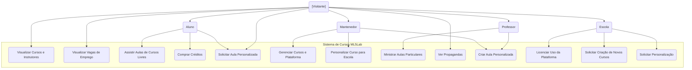

# Diagrama de Caso de Uso - ML5Lab

```mermaid
graph TD
    subgraph "Sistema de Cursos ML5Lab"
        direction LR

        uc1("Visualizar Cursos e Instrutores")
        uc2("Visualizar Vagas de Emprego")
        uc3("Assistir Aulas de Cursos Livres")
        uc4("Comprar Créditos")
        uc5("Solicitar Aula Personalizada")
        uc6("Gerenciar Cursos e Plataforma")
        uc7("Personalizar Curso para Escola")
        uc8("Ministrar Aulas Particulares")
        uc10("Ver Propagandas")
        uc11("Criar Aula Personalizada")
        uc12("Licenciar Uso da Plataforma")
        uc13("Solicitar Criação de Novos Cursos")
        uc14("Solicitar Personalização")

    end

    %% --- Atores ---
    atorVisitante("[Visitante]")
    atorAluno("Aluno")
    atorProfessor("Professor")
    atorEscola("Escola")
    atorMantenedor("Mantenedor")

    %% --- Relacionamentos (Generalização) ---
    atorVisitante --> atorAluno
    atorVisitante --> atorProfessor
    atorVisitante --> atorEscola
    atorVisitante --> atorMantenedor


    %% --- Associações (O que cada um faz) ---
    atorVisitante -- " " --> uc1
    atorVisitante -- " " --> uc2
    atorVisitante -- " " --> uc10
    atorVisitante -- " " --> uc5

    atorAluno -- " " --> uc3
    atorAluno -- " " --> uc4
    atorAluno -- " " --> uc5

    atorProfessor -- " " --> uc8
    atorProfessor -- " " --> uc11

    atorMantenedor -- " " --> uc6
    atorMantenedor -- " " --> uc7
    atorMantenedor -- " " --> uc11

    atorEscola -- " " --> uc12
    atorEscola -- " " --> uc13
    atorEscola -- " " --> uc14
```
