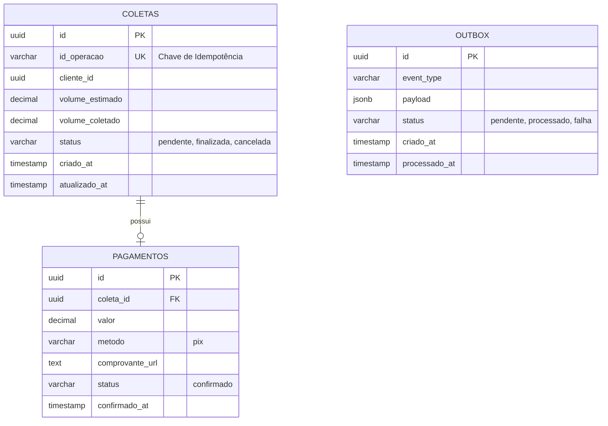

# Diagrama Entidade-Relacionamento (DER) - Óleo Padrão

Este diagrama utiliza a sintaxe [Mermaid.js](https://mermaid.js.org/) para representar a estrutura do banco de dados definida em `infra/db/init.sql`.

## Descrição das Tabelas

### 1. Coletas
Armazena o estado operacional das coletas em campo. O campo `id_operacao` é vital para garantir que a mesma operação enviada pelo app não seja processada duas vezes.

### 2. Pagamentos
Registra a transação financeira vinculada a uma coleta. Atualmente simplificado para focar em fluxos de Pix.

### 3. Outbox
Peça central da arquitetura orientada a eventos. Garante a entrega de mensagens (at-least-once delivery) ao persistir o evento na mesma transação que a regra de negócio.
